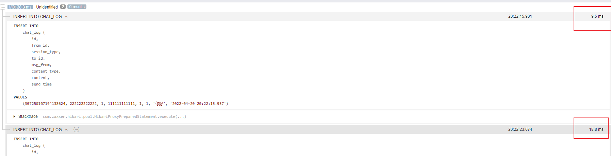

# 为什么单条sql加了事务执行速度会有这么大的差异

加事务前

```java
// @Transactional(rollbackFor = Exception.class)
public void insert(final ChatHistory chatLog) {
    chatLog.setId(IdGenerate.nextId());
    this.baseMapper.save(chatLog);
}
```

加事务后

```java
@Transactional(rollbackFor = Exception.class)
public void insert(final ChatHistory chatLog) {
    chatLog.setId(IdGenerate.nextId());
    this.baseMapper.save(chatLog);
}
```