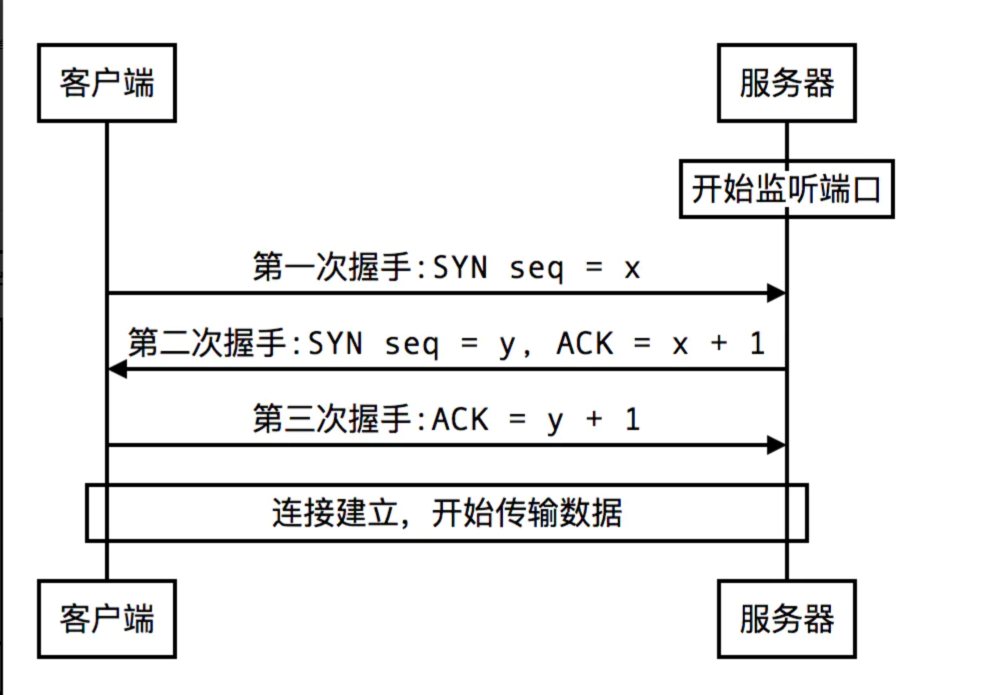
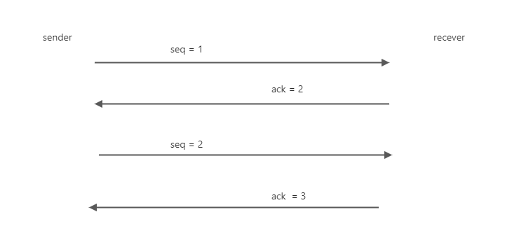

# TCP协议为什么可靠？
`TCP`和`UDP`最大的区别就是**TCP提供可靠的网络数据传输**。

## 为什么说TCP是可靠的？
常见的回答可能会是 _TCP是面向连接的_ ，提到连接，可能在我们印象中，就是有一个通道连接了两端。

在通信的时候，我们会把连接想象成一个独立的通道，建立连接后所有的数据都会从这个通道中传输，对方就能接收到完整的数据。

但是存在着各种可能，比如说硬件原因、网络阻塞、黑客攻击等的存在，即**网络的传输通道就是不可靠的**。

所以TCP中的连接不是一个通道，它只是**通信的双方建立的一对一的逻辑关系，使双方都明确了对方是自己的通信目标**。

既然只是一个逻辑关系，传输的过程中仍然会有各种可能的错误，那么建立连接的意义是什么？
- 标记数据传输的开始与结束 
- 保证通信的完整和正确

## TCP的三次握手

## TCP的ACK机制
`TCP`协议为了解决网络中的各种问题，就设计了`ACK机制`。

生产者发送数据后，需要收到消费者的ACK确认收到。**如果没有收到正确的ACK，就会重新发送到接收到正确的ACK为止**。

- 数据丢失： 
  - 如果没有在指定时间内收到ack，就会再次发送。 
- 数据乱序：
  - 比如发送方是seq = 4，接收方应该返回 ack = 5。但是这时候又收到了seq = 7，因为顺序错乱了，接收方会再次返回ack = 5.
- 数据错误：
  - 每个TCP数据都携带了checkSum，会根据这个来校验。
- 数据重复：
  - 接收方可以直接抛弃。

## ACK的优化
为了避免每次都ACK，浪费网络资源。服务器可能会等一段时间，直接按照最后一个数据的seq 返回ack。

总结
1. TCP的三次握手
   - 保证的建立连接的准确性
2. ACK机制
   - 保证数据的可靠性

## Link
[到底什么是TCP连接？](https://blog.csdn.net/zdavb/article/details/47790229)